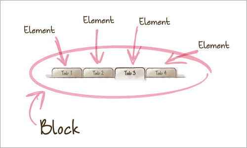
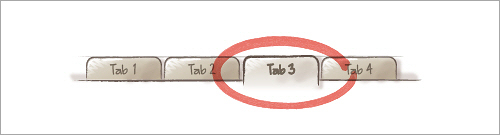

# Arquitetura CSS

* [Links úteis](#Links-úteis)
  * [Ferramentas](#Ferramentas)
  * [Artigos](#Artigos)
* [CSS orientado a objetos (CSSOO)](#CSS-orientado-a-objetos-(CSSOO))
  * [1. princípio - Separação de estrutura e de visual (skin)](#1.-princípio---Separação-de-estrutura-e-de-visual-(skin))
  * [2. princípio - Independência de containers e de conteúdos](#2.-princípio---Independência-de-containers-e-de-conteúdos)
* [Scalable and Modular Architecture for CSS (SMACSS)](#Scalable-and-Modular-Architecture-for-CSS-(SMACSS))
  * [Base](#Base)
  * [Layout (l-)](#Layout-(l-))
  * [Module](#Module)
  * [State (is-)](#State-(is-))
  * [Theme](#Theme)
* [Bloco, Elemento e Modificador (BEM)](#Bloco,-Elemento-e-Modificador-(BEM))
  * [Bloco](#Bloco)
  * [Elemento](#Elemento)
  * [Modificador](#Modificador)
  * [Dicas](#Dicas)

## Links úteis

### Ferramentas

- [Specificity Calculator](http://specificity.keegan.st/)
- [Reset CSS](https://meyerweb.com/eric/tools/css/reset/)

### Artigos

- [OOCSS, SMACSS, BEM, DRY CSS: afinal, como escrever CSS?](https://tableless.com.br/oocss-smacss-bem-dry-css-afinal-como-escrever-css/)
- [Organize seu CSS com SMACSS, BEM e SASS](https://medium.com/@larymagal/organize-seu-css-com-smacss-bem-e-sass-7e8f50a41544)

---

## CSS orientado a objetos ::CSSOO::
- Facilita manutenção de código.
- Evita repetição de código.

> Nessa técnica você categoriza os elementos na página como CSS Object. É um padrão visual que se repete e que pode ser abstraído em um contexto próprio
> Qualquer padrão visual que pode ser encaixado a outros elementos na página são objetos.
> A ideia é separar a estrutura de marcação de obrigações visuais. Separar o conteúdo do contexto. [(tableless)](https://tableless.com.br/arquitetura-css-anotacoes-da-palestra-rafael-rinaldi/)

> Um objeto CSS é formado por elementos:
> - HTML, que pode ser ou mais nós do DOM.
> - Declarações CSS, que estilizam estes nós, começando com o nome da classe referente ao wrapper.
> - Componentes como imagens de background e sprites, por exemplo.
> - Comportamentos JavaScript, listeners ou métodos associados.
> [(Matheus Castiglioni)](https://medium.com/trainingcenter/organizando-seu-c%C3%B3digo-css-parte-1-c0af96e4cc9f)

### 1. princípio - Separação de estrutura e de visual (skin)

> A ideia é que nós separemos as características visuais das características estruturais, tornando-os modulares de forma que possamos reutilizá-los em diferentes elementos tendo resultados iguais. [(tableless)](https://tableless.com.br/oocss-ou-css-do-jeito-certo/)


Neste exemplo abaixo, há muito código repetido desnecessáriamente, observa-se que somente o `background-color` muda de um exemplo para o outro. 

Ex:

HTML:
```
<div class="green-circle"></div>
<div class="yellow-circle"></div>
<div class="blue-circle"></div>
```

CSS:

```
.green-circle {
  width: 100px;
  height: 100px;
  border-radius: 50%;
  background-color: green
}

.yellow-circle {
  width: 100px;
  height: 100px;
  border-radius: 50%;
  background-color: yellow
}

.blue-circle {
  width: 100px;
  height: 100px;
  border-radius: 50%;
  background-color: purple
}
```

Assim, podemos criar uma nova classe para centralizar esse estilo estrutural em comum, mantendo o estilo visual, no caso o `background-color` idependente para cada um deles:

HTML:
```
<div class="circle green-circle"></div>
<div class="circle yellow-circle"></div>
<div class="circle blue-circle"></div>
```

CSS:

```
.circle {
  width: 100px;
  height: 100px;
  border-radius: 50%;
}

.green-circle {
  background-color: green
}

.yellow-circle {
  background-color: yellow
}

.blue-circle {
  background-color: purple
}
```

### 2. princípio - Independência de containers e de conteúdos

> Essencialmente quer dizer: Raramente use estilos que dependam de localização. Idealmente, um objeto deve parecer-se igual, independentemente de onde estiver na página, ou mesmo se trocar de página.
> [(Matheus Castiglioni)](https://medium.com/trainingcenter/organizando-seu-c%C3%B3digo-css-parte-1-c0af96e4cc9f)

**Independência de conteúdo**
Onde qualquer objeto poderá ser colocado em outro container sem ter sua aparência modificada. 
* a menos que se deseje modificar a aparência *

---

## Scalable and Modular Architecture for CSS (SMACSS)

O conceito do SMACSS é criar 5 camadas (arquivos) CSS separados em diretórios de acordo com sua função:

- base
- layout (l-)
- module
- state (is-)
- theme

### Base
Não utiliza seletores com classes ou id. 
Geralmente são arquivos de **reset** para unificar o estilo dos navegadores, **plugins**, etc.

Ou seja, é o arquivo base para tornar o estilo comum/igual em diferentes navegadores, por exemplo.

Um bom exemplo de reset: 

[Reset CSS](https://meyerweb.com/eric/tools/css/reset/)

### Layout (l-)
Recomenda-se utilizar IDs e classes com prefixo `l-`.

Parte estrutural do projeto, elementos únicos, como **header**, **footer**, **section**, **article**, **GRID**, **flexbox**.

### Module
Componentes.
Devem ser:

- independente 
- intercambiável

Exemplos: navbar, botão, formulários, cores, tipografia.

*! evite utilizar **elementos** dentro do módulo, utilização de classes é mais recomendado, por causa da independência*
*! não utilize IDs*

### State (is-)
Regras que gerenciam o estado dos componentes, como `hover` e `active`, por exemplo.

Então utilizamos classes com o prefixo `is-`:

Exemplo: 

`.is-active`

`.is-disabled`

### Theme 
Temas para o layout, como por exemplo, tema claro e tema escuro.

Geralmente insere-se uma classe referente ao tema na tag `<body>`.

ex: `<body class="theme-christmas">`

---

## Bloco, Elemento e Modificador (BEM)

É uma metodologia para nomear classes no CSS.


### Bloco


*[Img from smashmagazine](https://www.smashingmagazine.com/2012/04/a-new-front-end-methodology-bem/)*

```
.bloco {

}
```
Os blocos são componentes independentes que possibilitam sua fácil reutilização. Por serem independentes, mesmo que você modifique sua localização dentro da página (ou utilize em outros documentos) continuarão a funcionar normalmente.

Os blocos ainda poderão constituir-se de outros blocos. 

### Elemento (__)


*[Img from smashmagazine](https://www.smashingmagazine.com/2012/04/a-new-front-end-methodology-bem/)*

Utilizar dois _ (*underline*) para nomear 'filho' de um bloco.

```
.bloco__filho {

}
```

Um elemento é o filho de um bloco, e não deve ser usado fora deste bloco.

### Modificador (--)

Imagine uma aba ativa: 


*[Img from smashmagazine](https://www.smashingmagazine.com/2012/04/a-new-front-end-methodology-bem/)*

Utilizar dois - (*traço*) para nomear modificadores do 'filho' de um bloco.

```
.bloco__filho--modificador {

}
```

### Dicas

O BEM funciona bem usando o SMACSS como complemento em alguns casos...

Como no caso do uso de .is-active (SMACSS) ao invés de --active (BEM).

---

