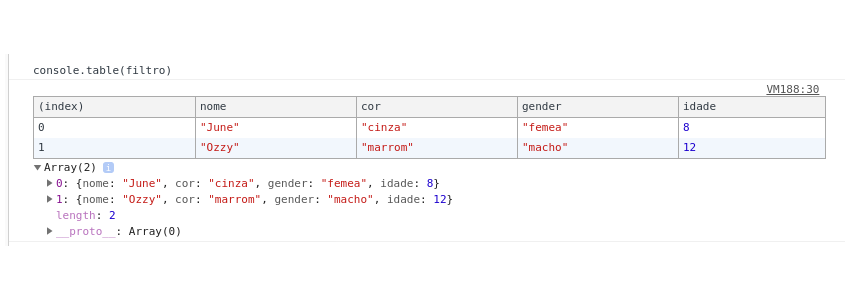

JavaScript Notes

# -> O JS pode ser adicionado de 3 formas:
- EXTERNO: linkado à um arquivo **.js** onde está todo o código. (é o modo mais recomendado, tendo em vista a maior facilidade de manutenção e tempo de carregamento da página).
  - exemplo linkado à um arquivo (as tags podem ser inseridas dentro das tags **head** ou **body**, sendo o mais recomendado como última linha dentro da tag **body**, pois melhora a velocidade de carregamento da página). Dentro de *src* inserir o nome do arquivo:
  ```html
  <script src="script.js"></script>
  ```

  ou se o arquivo estiver dentro de uma pasta além da pasta onde está o HTML, procedemos como no caso de imagens, acrescentando nome da pasta e \:

  ```html
  <script src="nomeDaPasta/script.js"></script>
  ```
- INTERNO: no próprio HTML, com o código dentro das tags '**script**' que podem ser adicionadas tanto dentro da tag '**head**' quanto da tag '**body**' (em uma ou ambas dependendo da necessidade.)
  ```html
  <script>
    document.getElementById("sayHello").innerHTML = "Hello!";
  </script>
  ```
- REFERÊNCIA EXTERNA: pode-se utilizar uma referência externa. Exemplo:
  ```html
  <script src="https://www.endereco.com/js/script.js"></script>
  ```


# JS: Valores primitivos e objetos

*O valor primitivo não tem parâmetros e métodos (mas tem propriedades).*

Valores primitivos:
- String
- Number
- Boolean
- Null
- undefined
- Symbol (novo no ECMAScript 6)

**Todos os outros valores, que não são primitivos, são objetos!**

---

# Output

- console.log()
- console.table()
- window.alert()
- document.write()
- inner.HTML


## console.log()
Irá aparecer no console do browser. Mais usado para testar o código.

## console.table()
Tabela exibida no console do browser.

## window.alert()
Irá abrir uma pequena caixa de alerta no browser.

## document.write()
Modifica o conteúdo HTML para exibição.

## inner.HTML
Modifica o conteúdo HTML para exibição.
No exemplo abaixo, *document* referencia-se ao arquivo HTML, *getElementById* diz para 'pegar'/ buscar um elemento no HTML e 'escrever'/modificar o conteúdo que está sobre esse *id* para o conteúdo que desejamos, no caso, a string "Olá!".

Exemplo:

```html
<script>
document.getElementById("exemplo").innerHTML = "Olá!";
</script>
```

HTML -> procura a tag que tem um *id* especificado -> insere conteúdo na página.

Exemplos de [W3Schools](https://www.w3schools.com/js/js_output.asp)


# Arrays [ ]

Sintaxe:
`var array = []`

Array exemplo:

*a, b e c* são elementos do array:
```js
var myArray = [a, b, c];
```

Chamamos de índice a posição dos elementos no array. Os índices sempre começam pelo 0.

assim os índices serão: 0, 1, 2, ...


### Verificar se é array

```js
var arr = []

Array.isArray(arr) // true
```


### Manipulando arrays

- acessar um item do array através do índice:
    
    *Utiliza-se notação de colchetes ([]) para acessar os item através de seus índices.*
    ```js
    arr = [1, 2, 3]
    arr[0] // retorna:  1
    arr[1] // retorna:  2
    arr[2] // retorna:  3
    ```

- add no final do array -> **push()**

Considere: `let myArray = [1, 2, 3]`;

```js
myArray.push(4); => [1, 2, 3, 4]
```

- add no começo do array -> **unshift()**
```js
myArray.unshift(0); => [0, 1, 2, 3, 4]
```

- remover no final do array -> **pop()**
```js
myArray.pop(); => [0, 1, 2, 3]
```

- remover no começo do array -> **shift()**
```js
myArray.shift(); => [1, 2, 3]
```

### Fazer cópia de array
Em alguns momentos, podemos querer copiar um array, por exemplo, para manipular o array sem modificar seu estado original, pois alguns métodos modificam o array original (como é o caso de sort e reverse, que veremos a seguir).

```js
[...arr]
```

ex

```js
let myArr = [1, 2, 3]
let newArr = [...myArr] // [1, 2, 3]
let otherArr = [0, ...myArr, 4, 5, 6, 7, 8, 9, 10]
```

### Array em ordem crescente (sort())
* sort altera o array principal!
* funciona para números e strings 
* ordena arrays em ordem crescente
* para ordenar arrays em forma decrescente, use o método reverse()

```js
arr.sort()
```

Exemplo:

```js
let array = [1, 5, 4, 2, 3]

array.sort() 

// resultado: array = [1, 2, 3, 4, 5]
```

Exemplo com string:

```js
let names = ["June", "Amora", "Ozzy", "Bob", "Scott"]

names.sort()


// resutado: names = ["Amora", "Bob", "June", "Ozzy", "Scott"]
```

**Fazer uma cópia de array ajuda para ordenar um array sem necessáriamente alterar o array principal!**

Exemplo: 

```js
let names = ["June", "Amora", "Ozzy", "Bob", "Scott"]

let namesSorted = [...names].sort()

```
Assim, names continua em seu estado original, e temos um novo array 'baseado' no primeiro, porém ordenado:

```js
// resutado: 
names = ["June", "Amora", "Ozzy", "Bob", "Scott"]

namesSorted = ["Amora", "Bob", "June", "Ozzy", "Scott"]
```

### Trabalhando com sort(): arrays com objetos
Para ordenamos arrays com objetos, temos uma forma um pouco diferente de usarmos o método sort, que irá variar para ordenar números e strings.

Considere o array abaixo:

```js
let friends = [
  {name: "Rui", age: 21},
  {name: "Manoela", age: 32},
  {name: "Felipe", age: 22},
  {name: "Valentina", age: 21}
]
```

#### Ordenando o array **friends** em ordem alfabética (nome)

```js
let sortNames = friends.sort(function(a, b) {
  var nameA = a.name.toUpperCase();
  var nameB = b.name.toUpperCase();
  if (nameA < nameB) {
    return -1;
  }
  if (nameA > nameB) {
    return 1;
  }
  return 0;
});

console.log(sortNames);

// resultado:
[
  {name: "Felipe", age: 22},
  {name: "Manoela", age: 32},
  {name: "Rui", age: 21},
  {name: "Valentina", age: 21}
]
```

#### Ordenando o array **friends** em ordem crescente (idade)

Considerando o mesmo array friends do exemplo anterior, vamos ordenar por idade ao invés de nomes:

```js
let sortAges = friends.sort(function (a, b) {
  return a.age - b.age;
});


console.log(sortAges);

// resultado:
[
  {name: "Rui", age: 21},
  {name: "Valentina", age: 21}
  {name: "Felipe", age: 22},
  {name: "Manoela", age: 32},
]
```

### Arrays em ordem decrescente (reverse())
* é o inverso de sort()
* modifica o array original

Exemplo:
```js
names = ["Amora", "Bob", "June", "Ozzy", "Scott"]

names.reverse()

// resultado: names = ["Scott", "Ozzy", "June", "Bob", "Amora"]

```

## map()
Transforma um array, retornando um array do mesmo tamanho.
*dica: bom para quando é necessário transformar os elementos de um array*

**sintaxe**

```js
array.map(function(valorAtual, index, arr), thisValue)

```

onde, `index, arr, thisValue` são opcionais.


**exemplo**
```js
let persons = [
  {
    firstName: 'Lays',
    lastName: 'Hidani'
  },
  {
    firstName: 'June',
    lastName: 'Hidani'
  }
]


persons.map(person => person.firstName + ' ' + person.lastName )

// resultado: ["Lays Hidani", "June Hidani"]
```

## filter()
Filtra itens de um array, seguindo algumas condições.
*dica: bom para selecionar um subconjunto de um array*

**sintaxe**
```js
array.filter(function(valorAtual, index, arr), thisValue)
```

onde, `index, arr, thisValue` são opcionais.


**exemplo**
```js
let pets = [
  {
    nome:  'June',
    cor: 'cinza',
    gender: 'femea',
    idade: 8
  },
  {
    nome:  'Rui',
    cor: 'tigrado',
    gender: 'macho',
    idade: 1
  },
  {
    nome:  'Ozzy',
    cor: 'marrom',
    gender: 'macho',
    idade: 12
  },
  {
    nome:  'Dexter',
    cor: 'tigrado',
    gender: 'macho',
    idade: 1
  }
]

const filtro = pets.filter(pet => (pet.idade > 5))

console.table(filtro)

```
resultado: 


## some()
Verificação booleana. Retorna `true` se algum item do array responde à condição.

**sintaxe**
```js
array.some(function(valorAtual, index, arr), thisValue)
```

onde, `index, arr, thisValue` são opcionais.


```js
pets.some(pet => pet.cor === 'tigrado')

// resultado: true
```

## every()
Verificação booleana. Retorna `true` se todos os itens do array responde à condição.


**sintaxe**
```js
array.every(function(valorAtual, index, arr), thisValue)

```

onde, `index, arr, thisValue` são opcionais.


**exemplo**

```js
pets.every(pet => pet.cor === 'marrom')

// resultado: false
```


## find()
Procura um item no array.
*dica: use para selecionar um único elemento do array*


**sintaxe**
```js
array.find(function(valorAtual, index, arr), thisValue)
```

onde, `index, arr, thisValue` são opcionais.


**exemplo**

```js
pets.find(pet => pet.cor === 'marrom')

//resultado: {nome: "Ozzy", cor: "marrom", gender: "macho", idade: 12}
```


## forEach()

Itera o array para executar determinada ação. Boa substituta do loop `for`.


**sintaxe**
```js
array.forEach(function(valorAtual, index, arr), thisValue)
```

onde, `index, arr, thisValue` são opcionais.


**exemplo**

```js
var array = [0, 1, 2, 3, 4, 5];
var total = 0;
 
function sum(number) {
  total += number; 
}
 
array.forEach(sum);
console.log(total);

// resultado: 15
```


## reduce()

*dica: use para derivar um único valor de outros vários elementos de um array.*


**sintaxe**
```js
array.reduce(function(total, valorAtual, index, arr), valorInicial)
```

onde, `index, arr, valorInicial` são opcionais.


**exemplo**

```js
let array = [1, 2, 3, 4, 5]

let result = array.reduce((total, number) => total + number)

console.log(result)

// resultado: 15
```

## Fatiar Array ou String slice()

> extrai o texto de uma string e retorna uma nova string. Alterações no texto em uma string não afetam a outra string. -MDN

**Sintaxe**

```js
array.slice(indexInicial, indexFinal)
```

onde `indexFinal` se não indicado, considera até o final do array

**Exemplo**

```js
'Tudo bem?'.slice(5)
// => resultado: "bem?"
```


## Alterar conteúdo do array splice()

> Altera o conteúdo de um array removendo ou substituindo elementos existentes e / ou adicionando novos elementos. -MDN

**Sintaxe**

```js
array.splice(index, howmany, item1, ....., itemX)
```

onde `howmany` e `items` são opicionais.

**Exemplo**

```js
let numbers = ['zero', 'um', 2, 3, 4, 'cinco']

numbers.splice(2, 3, 'dois', 'três', 'quatro') // retorna [2, 3, 4]

console.log(numbers)

// Resultado: ["zero", "um", "dois", "três", "quatro", "cinco"]
```

Neste exemplo, dissemos ao `splice(2, 3, 'dois', 'três', 'quatro')` para começar no **índice 2** do nosso array `numbers`, pegar os **3 elementos** a partir do índice 2, e substituí-los pelos elementos **'dois', 'três', 'quatro'**. 

Ele irá nos retornar os elementos que foram removidos.

Em seguida, podemos verificar essa substituição ao conferir os valores de numbers novamente.

---


# Ternário (versão reduzida de uma condição)

- if normal:
```js
if ( x < 10 ) {
  console.log( x );
} else {
  console.log( 10 );
}
```
- ternário
```js
x < 10 ? console.log( x ) : console.log( y );
```


---

# Objetos
conjunto de pares chave/valor (key/value)

```js
const obj = {
  chave: valor
}
```

## Acessar valor

`obj.chave` ou `obj['chave']`

## Alguns Métodos

```js
var myObj = {
    primeiroNome: 'Lays',
    ultimoNome: 'Hidani',
    idade: 28,
    pets: ['Dexter', 'Amora', 'Lola']
}
```

**-> Acessando valores**

```js
myObj["idade"]
// resultado: 28

myObj.primeiroNome
// resultado: "Lays"
```

**-> retorna array com todas as chaves (keys)**

```js
Object.keys(myObj)
["primeiroNome", "ultimoNome", "idade", "pets"]

Object.getOwnPropertyNames(myObj)
// resultado: ["primeiroNome", "ultimoNome", "idade", "pets"]
```

**-> retorna array com todos os valores (values)**

```js
Object.values(myObj)
// resultado: ["Lays", "Hidani", 28, Array(3)]
```

**-> Verifica a existência de uma chave/propriedade no objeto**

```js
myObj.hasOwnProperty('primeiroNome', idade)
// resultado: true

'primeiroNome' in myObj
// resultado: true
```

---
# Arrow function
Sintaxe:

```js
parametros => retorno
```


Exemplos:


```js
const exemplo = (x, y) => x + y;

const exemplo2 = () => 'Hello';

console.log(exemplo2) // Hello

const exemplo3 = text => text
```


---
# Regular Expressions (RegEx)

> Expressões regulares são padrões utilizados para selecionar combinações de caracteres em uma string. Em JavaScript, expressões regulares também são objetos. Elas podem ser utilizadas com os métodos *exec* e *test* do objeto RegExp, e com os métodos *match*, *replace*, *search*, e *split* do objeto String. _(MDN)

- .test() -> true/false
- exec() -> array
- .match() -> array/null
- search() -> índice/-1
- replace() -> procura e substitui
- split -> usa a regex ou uma string fixa para 'quebrar' uma string dentro de um array de substrings

> Quando você quer saber se um padrão é encontrado em uma string, use o método test ou search; para mais informações (mas execução mais lenta) use o método exec ou match. _(MDN)

## Modificadores
- i -> /code/i : ignora se é maiúscula ou minúscula
- g -> /code/g : encontra todas as compatibilidades
- m -> /code/m : verificação multilinha

## Alcance [ ]
- `/[abc]/` : busca por qualquer um dos caracteres entre [] (ou seja, procura por 'a', 'b', 'c')
- `/[x-y]/` : busca por caracteres entre a primeira letra e a segunda -> exemplo: de 'a' a 'z' -> a-z
- `/[0-9]/` : busca por qualquer caracteres entre os números estipulados
- `/[x|y]/` : busca por x ou y..
- `/[^code]/` : busca por caracteres diferentes dos informados -> exemplo: `/[^aeiou]/` -> procura por caracteres que não sejam vogais
- `/[code+]/` : busca por uma ou mais ocorrências -> exemplo: 

    ```js
      /[o+]/ 

      * ['ovo'] // => ['o', 'o']

      * ['voo'] // => ['oo']

      * ['voa'] // => ['o']
    ```
- `/[code*]/` : busca por  ou mais ocorrências
- `/[code]?/` : busca pela menor ocorrência (trecho)
  
  exemplo
  `'economia'.match(/o[a-z]*?o/) => 'ono'`


## Quantificadores
- n+ : busca por pelo menos uma ocorrência
- n* : busca por qualquer string que contenha 0 ou mais ocorrências de n
- n? : busca por 0 ou 1 ocorrência de n
- n{X} : busca a ocorrência de uma sequência de 'X' vezes -> ex: '1000, 10, 100, 1000'.match(/\d{4}/g)

TODO...cont


## Caracteres especiais

- \ : uma barra invertida que preceda um caractere não especial significa que o caractere seguinte é especial e não deve ser interpretado de forma literal. _(MDN)
- ^: procura por todos os caracteres que não sejam os informadaos.

TODO...cont


## literal

```js
/code/ 
```

ex:

```js
console.log(/comp/.test('computador')); // true
```

## Ou -> |

```js
/code1 | code2 | code3/
```

ex:


```js
console.log(/ball | dog | cat/.test('I see a dog.'));  // false, pois considera o espaço em branco
console.log(/ball|dog|cat/.test('I see a dog'));  // true
```

## Trecho

```js
/.code/
```

e


```js
/code./
`


ex:

```js
'brasileiro'.match(/br./)
```

## Procurar caracteres diferentes dos informados
```js
/[^code]/
```

## Procurar por ocorrência no início (^)
```js
/^code/
```

ex: 
FIXME
```
let greeting = "Hello World!";
let greetRegex = /^Hello/; 
let result = greetRegex.test(greeting); => true

```

## Procurar por ocorrência no final ($)
`/code$/`

ex: 

```
let greeting = "Hello World!";
let greetRegex = /World$/; 
let result = greetRegex.test(greeting); => true

```

## Procurar por mais de uma ocorrência seguida 
`/code+/`

Ex: `'voo'.match(/o+/g)` // => 'oo'

## Atalho: procurar todas as letras (maiúsculas e minúsculas), números e _ (\w)

`[A-Za-z0-9_] = /\w/g`

## Atalho: procurar todos os símbolos menos as letras (maiúsculas e minúsculas), números e _ (\W)

 `[^A-Za-z0-9_] = /\W/g`

## Atalho: procurar todas ocorrências de números (\d)

 `[0-9_] = /\d/g`

 ex

 ```
let numString = "Ganhamos um aumento de 10%";
let noNumRegex = /\D/g; // Change this line
let result = numString.match(noNumRegex).length; 

// => 24
 ```

## Atalho: procurar por espaços em branco (\s)
`/\s/g`

## Atalho: procurar por caracteres que não são espaços em branco (\S)
`/\S/g`

## Especificador de quantidade ({n,n})
(Procura ocorrência entre quantidade de um nº ao outro de vezes)

`/code{n,n}code/`

`/code{n,}code/`

ex:

`/ola{3,}a/.test('olaaaaa') // => true` 

## Especificador exato de quantidade ({n})
`/code{n}code/`

## Procurar 0 ou 1 ocorrência de caractére (?)
`/code?/`

ex:

```
/ama?/.test('ama') // => true
/ama?/.test('amar') // => true
/ama?/.test('amora') // => false
```

## Positive lookahead (?=...)
`/(?=code)/`

ex: checar se a senha tem entre 3 e 6 caracteres e pelo menos um número.

```
let senha = "ola321";
let checarSenha = /(?=\w{3,6})(?=\D*\d)/;
checarSenha.test(senha); // => true
```

## Negative lookahead (?=!...)
`/(?=!code)/`


## Repetição de grupo (()\número de vezes)
(funciona com .test e .match)

`/(code)\número de vezes/`

ex:

```
/(\w+)\s\1/;
```

## Capturar ocorrência e substituir (.replace)

ex:

```
'Hello mundo!'.replace(/Hello/, 'Olá') // => "Olá mundo!"`

`'bem tudo'.replace(/(\w+)\s(\w+)/, '$2 $1'); // => "tudo bem"`

`'99991111'.replace(/(\d{4})(\d{4})/, '$1-$2'); // => "9999-1111"
```

---

# JS WEB
- Mudar o conteúdo do HTML
- Mudar os valores de atributo do HTML
- Mudar o estilo CSS
- Mostrar e Esconder elementos no HTML


# DOM (document object model)

## Obter/selecionar elementos do HTML
Há duas formas de selecionar elementos: 
- getElement
- querySelector

### getElement
- document.getElementById('id'): obtem o elemento através do id
- document.getElementByClass('class'): obtem o elemento através da classe
- document.getElementsByName('name'): obtem o elemento através do nome
- document.getElementsByTagName('tag'): obtem o elemento através da tag

### QuerySelector
Usa os símbolos **#** e **.** assim como o CSS:

- documento.querySelector("#id"): obtem o elemento através do id
- documento.querySelector(".class"): obtem o elemento através da classe
- documento.querySelectorAll("elemento"): obtem todos os elementos com essa tag

## Template Literals (conhecidos como Template string antes do ES6)
Templates literals são strings que permitem expressões embutidas.

Uma forma de misturar texto (string) comum e variáveis de JS, por exemplo.

- Template Literals utiliza acentos graves (**`**) para indicar o início e o fim do código que deverá ser inserido.
- podemos inserir expressões que serão substituídas por seu resultado dentro do Template Literals, utilizando **placeholders**: `${expressão}`.

Exemplo:

```
let x = 100;
let y = 50;

console.log(`O resultado de ${x} + ${y} = ${x + y}`)

// resultado: O resultado de 100 + 50 = 150

```

## Inserir valor no HTML através de innerHTML e Template Literals

> A propriedade innerHTML retorna o texto, incluindo todas as tags de espaçamento e elemento interno. [-w3schools](https://www.w3schools.com/jsref/prop_node_textcontent.asp)


**Exemplo**

**HMTL**

```
<p>Bem vindo!</p>

```

**JS**

(obtém o valor)
Primeiro, seleciona o elemento do HTML. No caso, obtem-se a entrada/input do usuário através do prompt e guarda na variável `name`:

`var name = prompt("Olá, qual é o seu nome?");`

(diz onde quer inserir o valor)
Em seguida, seleciona o elemento do HTML onde será inserida a variável `name`:

`var welcome = document.querySelector("#user-name");`

(insere o valor)
Então, utiliza-se o `innerHTML`, para inserir no HTML o valor da variável `name`:

```
welcome.innerHTML = 
`
<p>
  Olá, ${name}.
</p>
`
```

## Modificar o conteúdo/texto (textContent)

> A propriedade textContent retorna o texto com espaçamento, mas sem tags de elementos internos. [-w3schools](https://www.w3schools.com/jsref/prop_node_textcontent.asp)

**HTML:**

`<p id="hello"></p>`

**JS:**

A frase abaixo, será inserida entre as tags `<p>` de id **hello**.
```
let getP = document.querySelector("#hello");

p.textContent = `Olá, ${name}. Seja bem vindo!`;
```


## Obter valor de input (.value)
**importante: costuma-se nomear com $ no início todas as variáveis no js que têm valores com origem do HTML**

**exemplo**

HTML:

`<input id="name"></input>`

JS:

`var $name = document.getElementById("name").value`

*o valor inserido no input com id `name` será armazenado na variável name*

* Adicionar ação ao clicar:

```
<p onclick = "função ()">Clique aqui</p>
```

```
document.getElementById("p")[0] ----> p índice 0  ----> [p, p, p]
```

## Obter valor de option (value="")
Usando `<select>` e `<option>`, para saber o valor selecionado, podemos inserir `value="valor"` em cada `<option>`.

HTML:

```
<select>
  <option value="A">A</option>
  <option value="B">B</option>
  <option value="C">C</option>
</select>
```

## Difinir ou retornar o valor de `<option>` (selectedIndex)

A propriedade selectedIndex define ou retorna o índice da opção selecionada em uma lista suspensa.

Imagine que queremos definir o valor do `value` de um `<select>` para que ele retorne à um padrão inicial:

```
typeMenu.selectedIndex = "type";
```


## Method: addEventListener()
Como o próprio nome diz, esse método fica 'escutando' tudo o que acontece na página, e 'dispaara' / executa determinada função quando determinado evento ocorre.

**sintaxe**

`addEventListener(event, function, useCapture)`

*useCapture é opcional, valor booleano*
*false- Default. O manipulador de eventos é executado na fase de bubbling*
*true - O manipulador de eventos é executado na fase de captura*

### events types 

[Acesse MDN para lista completa](https://developer.mozilla.org/pt-BR/docs/Web/Events)

Mais comuns:

- 'click': execulta a função quando elemento é clicado (botão, por exemplo)
- 'input': execulta a função após inserção de valor (quando algo é digitado em um input, por exemplo)
- 'change': execulta a função após mudança (quando selecionamos uma opção em um `select`, por exemplo)

**exemplo**

```
No HTML:
<button id="btn"></button>


no JS:
function hello() {
  console.log("Hello")
}

document.getElementById("btn").addEventListener("click", hello);
```

# Trabalhando com elementos no DOM

[Excelente Artigo: Mastering the DOM](https://medium.com/re-dom/master-the-dom-bc1a2a06089b)

## Criar elementos (createElement)
Sintaxe:

```
document.createElement(tagName)
```

Exemplo:

Criamos um elemento de tag `<p>` e associamos à variável p.

```
let p = document.createElement("p");
```

## Definir um atributo (setAttribute)
Sintaxe:

```
elemento.setAttribute("nomeDoAtributo", "valorDoAtributo")
```

Usando o exemplo anterior:

Atribuímos uma classe css de valor "hello" à tag `<p>` criada anteriormente.

```
p.setAttribute("class", "hello");
``` 

## Remover um atributo (removeAttribute)
Sintaxe:

```
elemento.removeAttribute("nomeDoAtributo", "valorDoAtributo")
```


## Outra forma de denifir classes (classList.add)

Outra forma de fazer o exemplo anterior seria:

```
p.classList.add("hello");
```

## Remover uma classe (classList.remove)
Sintaxe:

```
p.classList.remove("hello");
```

## Anexar elementos à elementos já existentes (appendChild)

Sintaxe:
```
document.parentName.appendChild(child);
```

Exemplo:

```
document.body.appendChild("p");
```

## Remover elementos de elementos já existentes (removeChild)
Da mesma forma que podemos anexar elementos filhos, também podemos removê-los:

Sintaxe:
```
document.parentName.removeChild(child);
```


