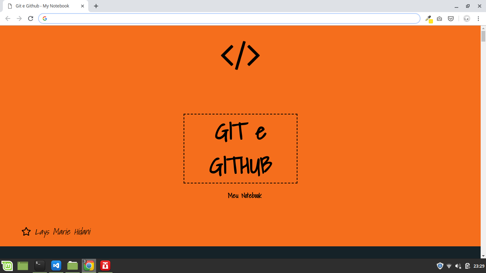

# [Notebook Git e GitHub ] [<Visualizar\>](https://layshidani.github.io/learning-front-end/projects/Git-GitHub-MyNotebook/)

Página com meu resumo sobre o conteúdo aprendido sobre Git e Github.  

## Sample

## Utilizado:

- HTML

- CSS

## Aprendido:

- HTML

- CSS 

    - margin

    - padding

    - importar fontes do Google APIs

    - Utilizar id e classe

---
